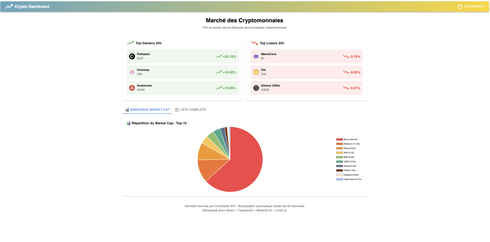
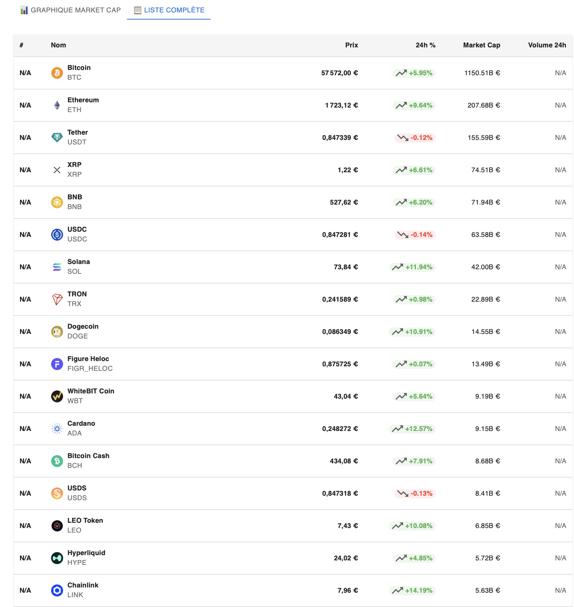
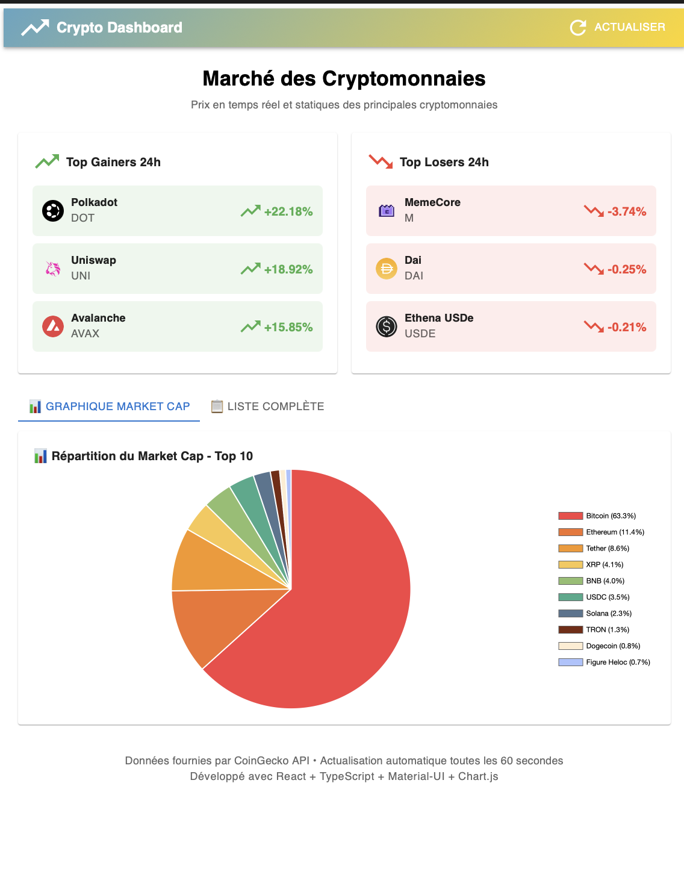
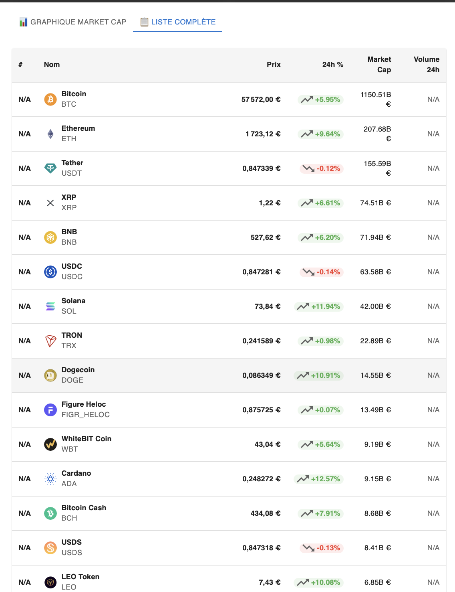

# 📊 Crypto Dashboard - Application React TypeScript


> Dashboard en temps réel des prix et statistiques des cryptomonnaies avec graphiques interactifs.

---

## 🌟 Démonstration en ligne

**🔗 [Voir l'application](https://cr-crypto-omega.vercel.app)** 


---

## ✨ Fonctionnalités

### 📊 Visualisation des données
- ✅ Prix en temps réel de 50+ cryptomonnaies via l'API CoinGecko
- ✅ Graphique camembert de la répartition du market cap (top 10)
- ✅ Tableau complet avec toutes les informations clés
- ✅ Actualisation automatique toutes les 60 secondes
- ✅ Interface à onglets (Graphique / Tableau)

### 📈 Statistiques
- ✅ Top 3 gainers (plus fortes hausses 24h)
- ✅ Top 3 losers (plus fortes baisses 24h)
- ✅ Market cap, volume 24h, variations en pourcentage
- ✅ Classement par capitalisation boursière

### 🎨 Interface utilisateur
- ✅ Design moderne avec Material-UI
- ✅ Interface 100% responsive (mobile, tablette, desktop)
- ✅ Indicateurs visuels intuitifs (vert/rouge, icônes)
- ✅ Tooltips informatifs sur les graphiques
- ✅ Animations fluides et professionnelles
- ✅ Gestion élégante des données manquantes (N/A)

### 🔧 Technique
- ✅ **TypeScript** pour un code type-safe
- ✅ Custom hooks pour la réutilisabilité
- ✅ Gestion d'état optimisée avec React hooks
- ✅ Architecture modulaire et maintenable
- ✅ Composants réutilisables

---

## 🛠 Technologies

| Technologie | Description | Version |
|------------|-------------|---------|
| **React** | Bibliothèque UI | 18.x |
| **TypeScript** | Typage statique | 5.x |
| **Vite** | Build tool rapide | 5.x |
| **Material-UI** | Framework de composants React | 5.x |
| **Chart.js** | Bibliothèque de graphiques | 4.x |
| **react-chartjs-2** | Wrapper React pour Chart.js | 5.x |
| **Axios** | Client HTTP | 1.x |
| **CoinGecko API** | API gratuite de données crypto | v3 |

---

## 📸 Screenshots

### Dashboard - Vue d'ensemble

*Interface principale avec statistiques et top movers*


### Tableau des cryptomonnaies

*Liste complète avec toutes les informations*

### Vue mobile

*Design responsive adapté aux smartphones*

### Tableau des cryptomonnaies

*Liste complète avec toutes les informations*
---

## 🚀 Installation

### Prérequis
- Node.js 18+ ([Télécharger](https://nodejs.org/))
- npm ou yarn
- Git

### 1. Cloner le projet
```bash
git clone https://github.com/votre-username/crypto-dashboard.git
cd crypto-dashboard
```

### 2. Installer les dépendances
```bash
npm install
```

### 3. Lancer en mode développement
```bash
npm run dev
```

L'application sera disponible sur `http://localhost:5173`

### 4. Build pour la production
```bash
npm run build
```

Les fichiers optimisés seront dans le dossier `dist/`

---

## 📁 Structure du projet

```
crypto-dashboard/
├── src/
│   ├── components/
│   │   ├── CryptoList.tsx          # Tableau des cryptos
│   │   ├── CryptoCard.tsx          # Card individuelle
│   │   ├── MarketCapChart.tsx      # Graphique camembert
│   │   └── TopMovers.tsx           # Top gainers/losers
│   ├── hooks/
│   │   └── useCryptos.ts           # Custom hook API
│   ├── services/
│   │   └── cryptoApi.ts            # Service API CoinGecko
│   ├── types/
│   │   └── crypto.ts               # Types TypeScript
│   ├── utils/
│   │   └── formatters.ts           # Fonctions utilitaires
│   ├── App.tsx                     # Composant principal
│   └── main.tsx                    # Point d'entrée
├── package.json
├── tsconfig.json
├── vite.config.ts
└── README.md
```

---

## 🎯 Fonctionnalités détaillées

### Custom Hook `useCryptos`

Hook personnalisé pour gérer l'état et les appels API avec auto-refresh :

```typescript
const { cryptos, loading, error, refresh } = useCryptos(true);
```

**Paramètres :**
- `autoRefresh` (boolean) : Active l'actualisation automatique toutes les 60s

**Retourne :**
- `cryptos` : Liste des cryptomonnaies
- `loading` : État de chargement
- `error` : Message d'erreur éventuel
- `refresh` : Fonction pour actualiser manuellement

### Service API

Service centralisé pour interagir avec CoinGecko API :

```typescript
// Récupérer les données du marché
const cryptos = await cryptoApi.getMarketData({ per_page: 50 });

// Récupérer l'historique d'une crypto
const history = await cryptoApi.getMarketChart('bitcoin', 7);

// Rechercher des cryptos
const results = await cryptoApi.searchCryptos('ethereum');
```

### Fonctions utilitaires

```typescript
// Formater un prix
formatPrice(50000) // "50 000,00 €"

// Formater un grand nombre
formatLargeNumber(1000000000) // "1.00B €"

// Formater un pourcentage
formatPercentage(5.5) // "+5.50%"

// Obtenir la couleur selon le signe
getChangeColor(5.5) // "#4caf50" (vert)
```

---

## 🎨 Composants

### CryptoList
Tableau Material-UI responsive affichant toutes les cryptos avec :
- Image, nom et symbole
- Prix actuel formaté
- Variation 24h avec indicateur visuel (Chip coloré)
- Market cap et volume formatés
- Gestion des valeurs manquantes (N/A)

### MarketCapChart
Graphique en camembert (Chart.js) présentant :
- Répartition du market cap des 10 premières cryptos
- Pourcentages calculés automatiquement
- Légende interactive et responsive
- Tooltips détaillés avec valeurs et pourcentages
- Palette de couleurs professionnelle

### TopMovers
Affiche les 3 plus fortes hausses et baisses du jour :
- Cards colorées distinctives (vert pour hausses, rouge pour baisses)
- Icônes de tendance (TrendingUp/TrendingDown)
- Pourcentages mis en évidence
- Layout responsive (2 colonnes desktop, 1 colonne mobile)

---

## 🌐 Déploiement sur Vercel

### Déploiement automatique

1. Connectez votre dépôt GitHub à Vercel
2. Vercel détecte automatiquement Vite
3. Configuration par défaut fonctionne parfaitement
4. Déploiement automatique à chaque push sur `main`

### Configuration manuelle (si nécessaire)

- **Framework Preset** : Vite
- **Build Command** : `npm run build`
- **Output Directory** : `dist`
- **Install Command** : `npm install`

### Variables d'environnement

Aucune variable nécessaire car l'API CoinGecko est gratuite et ne requiert pas de clé.

---

## 📊 API CoinGecko

### Endpoints utilisés

| Endpoint | Usage | Paramètres | Limite |
|----------|-------|------------|--------|
| `/coins/markets` | Liste des cryptos avec données marché | `vs_currency`, `order`, `per_page` | 50/min |
| `/coins/{id}/market_chart` | Historique des prix | `vs_currency`, `days` | 50/min |
| `/coins/{id}` | Détails complets d'une crypto | `localization`, `market_data` | 50/min |

### Exemple de réponse

```json
{
  "id": "bitcoin",
  "symbol": "btc",
  "name": "Bitcoin",
  "current_price": 50000,
  "market_cap": 1000000000000,
  "price_change_percentage_24h": 5.5,
  "total_volume": 50000000000
}
```

**Note :** API gratuite sans clé requise. Limitée à 50 requêtes/minute.

---

## 🐛 Problèmes rencontrés et solutions

Au cours du développement, plusieurs défis techniques ont été surmontés :

### 1. **Erreur TypeScript avec Material-UI Grid**

**Problème :**
```
Property 'item' does not exist on type 'IntrinsicAttributes & GridBaseProps'
```

**Cause :** 
Incompatibilité entre Material-UI v5/v6 et les props `Grid`. La nouvelle API Grid2 a changé la syntaxe.

**Solution :**
Remplacement de `Grid` par `Box` avec CSS Grid natif :

```tsx
// ❌ AVANT (ne fonctionnait pas)
<Grid container spacing={3}>
  <Grid item xs={12} md={6}>
    <Paper>...</Paper>
  </Grid>
</Grid>

// ✅ APRÈS (fonctionne)
<Box sx={{
  display: 'grid',
  gridTemplateColumns: { xs: '1fr', md: '1fr 1fr' },
  gap: 3,
}}>
  <Paper>...</Paper>
</Box>
```

**Leçon apprise :** Les versions récentes de Material-UI ont modifié l'API Grid. Box avec CSS Grid natif est plus stable et évite les conflits de versions TypeScript.

---

### 2. **Erreur `undefined is not an object` sur formatLargeNumber**

**Problème :**
```
TypeError: num.toLocaleString is not a function
```

**Cause :** 
Certaines cryptomonnaies de l'API CoinGecko ont des valeurs `null` ou `undefined` pour `market_cap` ou `total_volume`.

**Solution :**
Ajout de vérifications robustes dans les fonctions de formatage :

```typescript
const formatLargeNumber = (num: number | null | undefined): string => {
  // ⭐ Vérification ajoutée
  if (num === null || num === undefined || isNaN(num)) {
    return 'N/A';
  }
  
  if (num >= 1_000_000_000) {
    return `${(num / 1_000_000_000).toFixed(2)}B €`;
  }
  // ...
};
```

**Leçon apprise :** Toujours vérifier les valeurs nullables avant d'appeler des méthodes. Les données d'API externes peuvent être incomplètes.

---

### 3. **Crash sur `price_change_percentage_24h.toFixed(2)`**

**Problème :**
```
TypeError: null is not an object (evaluating 'crypto.price_change_percentage_24h.toFixed')
```

**Cause :** 
Certaines cryptos très récentes ou peu liquides n'ont pas de variation 24h calculée (valeur `null`).

**Solution :**
Rendu conditionnel avec gestion du cas null :

```tsx
const changeValue = crypto.price_change_percentage_24h ?? 0;
const hasValidChange = crypto.price_change_percentage_24h !== null;

{hasValidChange ? (
  <Chip label={`${changeValue.toFixed(2)}%`} />
) : (
  <Typography>N/A</Typography>
)}
```

**Leçon apprise :** Ne jamais supposer qu'une propriété existe. L'opérateur `??` (nullish coalescing) est très utile pour les valeurs par défaut.

---

### 4. **Module '@mui/material/Grid2' introuvable**

**Problème :**
```
Cannot find module '@mui/material/Grid2'
Cannot find module '@mui/material/Unstable_Grid2'
```

**Cause :** 
Confusion entre les différentes versions de Material-UI (v5, v6) et leurs APIs Grid respectives.

**Solutions testées :**
1. ❌ `import Grid from '@mui/material/Grid2'` → N'existe pas en v5
2. ❌ `import Grid from '@mui/material/Unstable_Grid2'` → Pas disponible dans toutes les versions
3. ✅ Remplacement par `Box` avec CSS Grid → Fonctionne partout

**Leçon apprise :** Éviter les features "Unstable" en production. Les APIs natives (CSS Grid) sont souvent plus fiables que les abstractions qui peuvent changer entre versions.

---

### 5. **Auto-refresh consommait trop de requêtes API**

**Problème :** 
Limite de 50 requêtes/minute atteinte rapidement avec l'auto-refresh.

**Solution :**
Implémentation d'un intervalle intelligent de 60 secondes :

```typescript
useEffect(() => {
  if (!autoRefresh) return;

  const interval = setInterval(() => {
    fetchCryptos();
  }, 60000); // 60 secondes

  return () => clearInterval(interval);
}, [autoRefresh, fetchCryptos]);
```

**Optimisation supplémentaire :**
- Nettoyage de l'intervalle lors du démontage du composant
- Option pour désactiver l'auto-refresh

**Leçon apprise :** Toujours implémenter un cleanup dans useEffect pour éviter les fuites mémoire et respecter les rate limits des APIs.

---

### 6. **Gestion des erreurs réseau**

**Problème :** 
L'application crashait complètement si l'API était indisponible.

**Solution :**
Système de gestion d'erreurs robuste :

```typescript
try {
  const data = await cryptoApi.getMarketData();
  setCryptos(data);
  setError(null);
} catch (err) {
  setError(err instanceof Error ? err.message : 'Une erreur est survenue');
  console.error('Erreur lors du chargement des cryptos:', err);
} finally {
  setLoading(false);
}
```

Avec affichage utilisateur :

```tsx
{error && (
  <Alert severity="error" onClose={() => window.location.reload()}>
    {error}
  </Alert>
)}
```

**Leçon apprise :** Toujours prévoir un plan B. Les erreurs réseau sont inévitables et doivent être gérées gracieusement.

---

## 📚 Leçons apprises

### **Développement :**
1. ✅ **TypeScript protège** : Les erreurs de type détectées avant l'exécution
2. ✅ **Vérifier les données** : Ne jamais supposer qu'une propriété existe
3. ✅ **APIs natives** : Parfois plus fiables que les abstractions (ex: CSS Grid vs MUI Grid)
4. ✅ **Cleanup important** : Toujours nettoyer les intervals/subscriptions dans useEffect

### **APIs externes :**
1. ✅ **Données incomplètes** : Les APIs peuvent retourner null/undefined
2. ✅ **Rate limiting** : Respecter les limites avec des intervals intelligents
3. ✅ **Gestion d'erreurs** : Prévoir que l'API peut être indisponible

### **TypeScript :**
1. ✅ **Types unions** : `number | null | undefined` pour gérer tous les cas
2. ✅ **Opérateur ??** : Meilleur que `||` pour les valeurs par défaut
3. ✅ **Types stricts** : Force à penser aux cas limites

### **React & Hooks :**
1. ✅ **Custom hooks** : Centraliser la logique réutilisable
2. ✅ **useEffect cleanup** : Éviter les fuites mémoire
3. ✅ **Rendu conditionnel** : Toujours prévoir le cas "pas de données"

---

## 🚧 Roadmap

### Version 1.1 (À venir)
- [ ] Page détail crypto avec graphique personnalisable
- [ ] Recherche de cryptos en temps réel
- [ ] Favoris avec localStorage
- [ ] Mode sombre
- [ ] Sélection de devise (EUR/USD/BTC)

### Version 2.0 (Futur)
- [ ] Portfolio tracking (suivre ses investissements)
- [ ] Alertes de prix par email/notification
- [ ] Conversion multi-devises
- [ ] Graphiques avancés (Recharts)
- [ ] Comparaison de 2 cryptos côte à côte

### Version 3.0 (Vision)
- [ ] PWA (mode offline)
- [ ] API Backend propre (cache, rate limiting)
- [ ] Authentification utilisateur
- [ ] Historique des prix sur 1 an
- [ ] Export des données en CSV/PDF

---

## 🤝 Contribution

Les contributions sont les bienvenues !

1. Forkez le projet
2. Créez une branche (`git checkout -b feature/AmazingFeature`)
3. Committez vos changements (`git commit -m 'Add AmazingFeature'`)
4. Pushez vers la branche (`git push origin feature/AmazingFeature`)
5. Ouvrez une Pull Request

---

## 📝 Licence

Ce projet est sous licence MIT. Voir le fichier [LICENSE](LICENSE) pour plus de détails.

---

## 👨‍💻 Auteur

**Votre Nom**

<!-- - 🌐 Portfolio : [votre-site.com](https://votre-site.com) -->
- 💼 LinkedIn : [Clément roland](https://linkedin.com/in/roland-971)
- 🐙 GitHub : [clément roland](https://github.com/clementR97)
- 📧 Email : clementroland52@gmail.com

---

## 🙏 Remerciements

- [CoinGecko](https://www.coingecko.com/) pour l'API gratuite et complète
- [Material-UI](https://mui.com/) pour les composants UI magnifiques
- [Chart.js](https://www.chartjs.org/) pour les graphiques interactifs
- [Vite](https://vitejs.dev/) pour le build tool ultra-rapide
- La communauté React/TypeScript pour le support

---

## 📚 Ressources & Documentation

### Documentation officielle
- [React Documentation](https://react.dev/)
- [TypeScript Documentation](https://www.typescriptlang.org/)
- [Material-UI Documentation](https://mui.com/)
- [Chart.js Documentation](https://www.chartjs.org/)
- [CoinGecko API](https://www.coingecko.com/api/documentation)

### Tutoriels utiles
- [React TypeScript Cheatsheet](https://react-typescript-cheatsheet.netlify.app/)
- [Material-UI Customization Guide](https://mui.com/material-ui/customization/theming/)
- [Chart.js Getting Started](https://www.chartjs.org/docs/latest/getting-started/)

---

## 💬 Support

Pour toute question ou problème :
- 🐛 Ouvrez une [issue](https://github.com/clementR97/crypto/issues)
- 💬 Contactez-moi par [email](clementroland52@gmail.com)
- 💼 Connectez-vous sur [LinkedIn](https://linkedin.com/in/votre-profil)

---

## 📊 Statistiques du projet

- **Lignes de code** : ~1500
- **Composants React** : 5
- **Fonctions utilitaires** : 4
- **Custom hooks** : 1
- **Durée de développement** : 2 jours
- **Technologies** : 8
- **Bugs résolus** : 6 majeurs

---

**⭐ Si ce projet vous plaît, n'hésitez pas à lui donner une étoile sur GitHub !**

---

*Développé avec ❤️ et TypeScript*

*Projet réalisé dans le cadre de l'apprentissage du développement frontend moderne (Février 2026)*