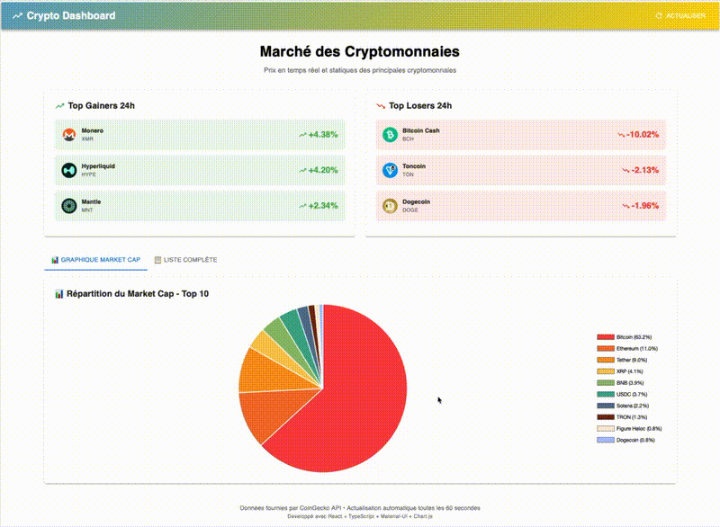

# 📊 Crypto Dashboard - Application React TypeScript


> Dashboard en temps réel des prix et statistiques des cryptomonnaies avec graphiques interactifs.

---

## 🌟 Démonstration en ligne

**🔗 [Voir l'application](https://cr-crypto-omega.vercel.app)** 



---

## ✨ Fonctionnalités

### 📊 Visualisation des données
- ✅ Prix en temps réel de 50+ cryptomonnaies
- ✅ Graphique camembert de la répartition du market cap (top 10)
- ✅ Tableau complet avec tri et filtres
- ✅ Actualisation automatique toutes les 60 secondes

### 📈 Statistiques
- ✅ Top 3 gainers (plus fortes hausses 24h)
- ✅ Top 3 losers (plus fortes baisses 24h)
- ✅ Market cap total
- ✅ Volume 24h
- ✅ Variations en pourcentage

### 🎨 Interface utilisateur
- ✅ Design moderne avec Material-UI
- ✅ Interface responsive (mobile, tablette, desktop)
- ✅ Indicateurs visuels (vert pour hausse, rouge pour baisse)
- ✅ Tooltips informatifs sur les graphiques
- ✅ Animations fluides

---

## 🛠 Technologies

| Technologie | Description | Version |
|------------|-------------|---------|
| **React** | Bibliothèque UI | 18.x |
| **TypeScript** | Typage statique | 5.x |
| **Vite** | Build tool rapide | 5.x |
| **Material-UI** | Framework de composants React | 5.x |
| **Chart.js** | Bibliothèque de graphiques | 4.x |
| **Axios** | Client HTTP | 1.x |
| **CoinGecko API** | API gratuite de données crypto | v3 |

---

## 🚀 Installation

### Prérequis
- Node.js 18+ ([Télécharger](https://nodejs.org/))
- npm ou yarn

### 1. Cloner le projet
```bash
git clone https://github.com/votre-username/crypto-dashboard.git
cd crypto-dashboard
```

### 2. Installer les dépendances
```bash
npm install
```

### 3. Lancer en mode développement
```bash
npm run dev
```

L'application sera disponible sur `http://localhost:5173`

### 4. Build pour la production
```bash
npm run build
```

---

## 📁 Structure du projet

```
crypto-dashboard/
├── src/
│   ├── components/
│   │   ├── CryptoList.tsx          # Tableau des cryptos
│   │   ├── CryptoCard.tsx          # Card d'une crypto
│   │   ├── MarketCapChart.tsx      # Graphique camembert
│   │   └── TopMovers.tsx           # Top gainers/losers
│   ├── hooks/
│   │   └── useCryptos.ts           # Custom hook API
│   ├── services/
│   │   └── cryptoApi.ts            # Service API CoinGecko
│   ├── types/
│   │   └── crypto.ts               # Types TypeScript
│   ├── App.tsx                     # Composant principal
│   └── main.tsx                    # Point d'entrée
├── package.json
├── tsconfig.json
└── README.md
```

---

## 🎯 Fonctionnalités détaillées

### Custom Hook `useCryptos`

Hook personnalisé pour gérer l'état et les appels API :

```typescript
const { cryptos, loading, error, refresh } = useCryptos(true);
```

- `cryptos` : Liste des cryptomonnaies
- `loading` : État de chargement
- `error` : Message d'erreur éventuel
- `refresh` : Fonction pour actualiser les données
- `true` : Active l'auto-refresh (60s)

### Service API

Service centralisé pour interagir avec CoinGecko API :

```typescript
// Récupérer les données du marché
const cryptos = await cryptoApi.getMarketData({ per_page: 50 });

// Récupérer l'historique d'une crypto
const history = await cryptoApi.getMarketChart('bitcoin', 7);

// Rechercher des cryptos
const results = await cryptoApi.searchCryptos('ethereum');
```

---

## 🎨 Composants

### CryptoList
Tableau Material-UI affichant toutes les cryptos avec :
- Image et nom
- Prix actuel
- Variation 24h avec indicateur visuel
- Market cap
- Volume 24h

### MarketCapChart
Graphique en camembert (Chart.js) montrant :
- Répartition du market cap des 10 premières cryptos
- Pourcentages calculés automatiquement
- Légende interactive
- Tooltips avec valeurs détaillées

### TopMovers
Affiche les 3 plus fortes hausses et baisses :
- Cards colorées (vert/rouge)
- Icônes de tendance
- Pourcentages en gros

---

## 🌐 Déploiement sur Vercel

### 1. Connectez votre repo GitHub

### 2. Déployez sur Vercel
```bash
npm install -g vercel
vercel
```

### 3. Configuration
- **Framework Preset** : Vite
- **Build Command** : `npm run build`
- **Output Directory** : `dist`

### 4. Variables d'environnement
Aucune variable nécessaire (API gratuite sans clé)

---

## 📊 API CoinGecko

### Endpoints utilisés

| Endpoint | Usage | Limite |
|----------|-------|--------|
| `/coins/markets` | Liste des cryptos | 50/minute |
| `/coins/{id}/market_chart` | Historique prix | 50/minute |
| `/coins/{id}` | Détails crypto | 50/minute |

**Note :** API gratuite sans clé requise. Limitée à 50 requêtes/minute.

---

## 🧪 Tests

```bash
# Lancer les tests (à implémenter)
npm test
```

---

## 🐛 Problèmes courants

### L'API ne répond pas
**Cause :** Limite de requêtes atteinte (50/min)  
**Solution :** Attendez 1 minute ou implémentez un cache

### Les graphiques ne s'affichent pas
**Cause :** Chart.js non enregistré  
**Solution :** Vérifiez `ChartJS.register(...)` dans le composant

### TypeScript errors
**Cause :** Types manquants  
**Solution :** `npm install -D @types/node`


---

## 📚 Ressources

- [Documentation React](https://react.dev/)
- [Documentation TypeScript](https://www.typescriptlang.org/)
- [Documentation Material-UI](https://mui.com/)
- [Documentation Chart.js](https://www.chartjs.org/)
- [CoinGecko API](https://www.coingecko.com/api/documentation)

---

## 🤝 Contribution

Les contributions sont les bienvenues !

1. Forkez le projet
2. Créez une branche (`git checkout -b feature/AmazingFeature`)
3. Committez (`git commit -m 'Add AmazingFeature'`)
4. Pushez (`git push origin feature/AmazingFeature`)
5. Ouvrez une Pull Request

---

## 📝 Roadmap

### Version 1.1 (à venir)
- [ ] Page détail crypto avec graphique personnalisable
- [ ] Recherche de cryptos
- [ ] Favoris (localStorage)
- [ ] Mode sombre
- [ ] Comparaison de 2 cryptos

### Version 2.0 (futur)
- [ ] Portfolio tracking
- [ ] Alertes de prix
- [ ] Conversion multi-devises
- [ ] Graphiques avancés (Recharts)
- [ ] PWA (offline mode)

---

## 📝 Licence

MIT License - Voir [LICENSE](LICENSE) pour plus de détails

---

## 👨‍💻 Auteur

**Votre Nom**

<!-- - 🌐 Portfolio : [votre-site.com](https://votre-site.com) -->
- 💼 LinkedIn : [Clément Roland](https://linkedin.com/in/roland-971)
- 🐙 GitHub : [@clementR97](https://github.com/clementR97)

---

## 🙏 Remerciements

- [CoinGecko](https://www.coingecko.com/) pour l'API gratuite
- [Material-UI](https://mui.com/) pour les composants UI
- [Chart.js](https://www.chartjs.org/) pour les graphiques
- La communauté React pour le support

---

**⭐ Si ce projet vous plaît, n'hésitez pas à lui donner une étoile sur GitHub !**

---

*Développé avec ❤️ et TypeScript*